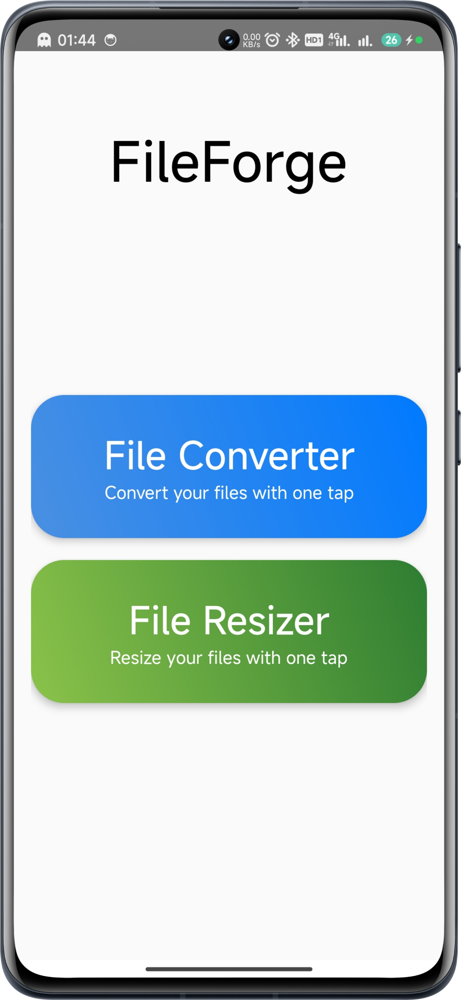
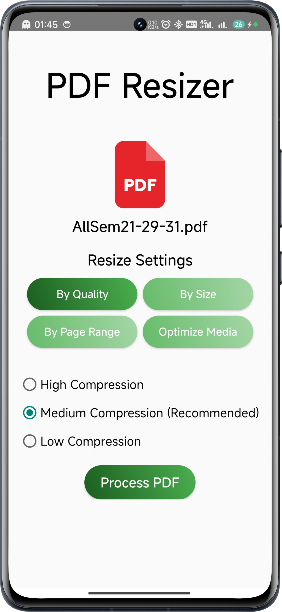

# 📁 FileForge

**FileForge** is a powerful and lightweight Android application that enables users to **convert** and **resize** various file types such as PDFs, Word documents, PowerPoint presentations, Excel sheets, and images — all from a clean and intuitive interface.

---

## ✨ Features

- 📂 **File Explorer Integration** – Browse and select files from your internal storage
- 🔄 **File Conversion** – Seamlessly convert between formats (PDF, DOC, PPT, XLS, JPG, PNG, etc.)
- 📏 **Resize Support** – Reduce the size of images and PDF files
- 🌙 **Dark Mode Toggle** – Support for system dark mode (added or in-progress)
- 🧭 **Minimal UI** – Fast, responsive, and easy to use

---

## 📸 Screenshots

### 🔹 Home Screen and PDF Resizer

<p float="left">
  &nbsp;&nbsp;&nbsp;
  
  &nbsp;&nbsp;&nbsp;&nbsp;
  
</p>

---

## 🚀 Tech Stack

| Tech           | Description                      |
|----------------|----------------------------------|
| **Java**       | Primary programming language     |
| **Android SDK**| Base framework for development   |
| **XML**        | Used for designing UI layouts    |
| **Material Design** | UI/UX principles for Android apps |
| **Git & GitHub** | Version control & collaboration |

---

## 🧩 Folder Structure

```
FileForge/
├── app/
│   └── src/
│       └── main/
│           ├── java/com/example/fileforge/  # Java source code
│           ├── res/                         # UI layouts & assets
│           └── AndroidManifest.xml
├── build.gradle
├── .gitignore
├── README.md
└── LICENSE
```

---

## 📥 How to Contribute

1. 🍴 Fork the repository
2. 🛠️ Make your changes
3. 🔁 Create a Pull Request
4. 💬 Let's review and merge!

---

## 👤 Author

**Aditya Das**  
📍 Dr. B. C. Roy Engineering College, Durgapur  
🔗 [LinkedIn](https://www.linkedin.com/in/adadityadas)  
🐙 [GitHub](https://github.com/CodeSmithAditya)

---

## 📄 License

This project is licensed under the **[MIT License](LICENSE)** – feel free to use, modify, and distribute it.
